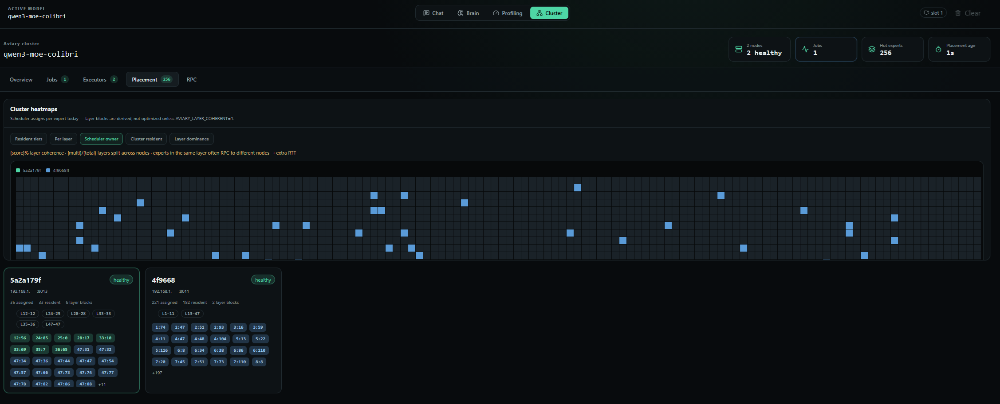
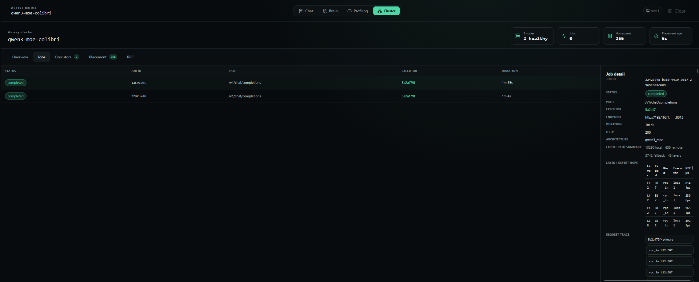

```
   _____       .__                     
  /  _  \___  _|__|____ _______ ___.__.
 /  /_\  \  \/ /  \__  \\_  __ <   |  |
/    |    \   /|  |/ __ \|  | \/\___  |
\____|__  /\_/ |__(____  /__|   / ____|
        \/             \/       \/     
        distributed MoE inference cluster
```

<p align="center">
  <strong>Apache Spark–like control plane for MoE inference — commodity boxes, full weights on every node, activations over the LAN.</strong>
</p>

<p align="center">
  <a href="docs/AVIARY.md"><b>Docs</b></a> ·
  <a href="docs/qwen3_moe.md"><b>Qwen3</b></a> ·
  <a href="docs/hy3.md"><b>Hy3</b></a> ·
  <a href="docs/cluster_protocol.md"><b>Protocol</b></a> ·
  <a href="docs/COLIBRI_SYNC.md"><b>Upstream sync</b></a>
</p>

## Mission

**Run large Mixture-of-Experts language models across a cluster of ordinary machines — as fast as possible.**

Frontier MoEs are huge, but only a thin slice of experts is active per token. Datacenter GPU racks are one answer; another is the hardware many teams already own: several boxes with fast NVMe, plenty of RAM, and maybe a GPU each.

Aviary is the **cluster control plane** for that world. It borrows Apache Spark’s mental model — a **master**, **executors (agents)**, **jobs**, and a placement view — and applies it to sparse MoE inference:

| Spark idea | Aviary |
|---|---|
| Master | Registry, chat routing, placement scheduler, Cluster dashboard |
| Executors | One MoE engine per machine (agent) |
| Jobs | Each chat / completions request, with expert hop traces |
| Placement | Which node should own which hot expert |

Point any OpenAI-compatible client (or the built-in dashboard) at one master URL. The flock routes work, tracks expert heat, and decides when a peer’s hot expert beats a local disk load.

### Why full weights on every agent?

Aviary assumes the **same checkpoint lives on every agent’s disk**. During inference the network carries **activations and control**, not model shards.

Shipping base weights over the LAN has repeatedly proven cumbersome in other distributed-inference projects: checkpoint RTT, bandwidth contention, and cold-start pain dominate before you ever win on compute. Aviary’s bet is different:

1. **Copy once** — put the full model on each node’s NVMe (rsync, `hf download`, USB, whatever).
2. **Infer many times** — keep weights local; RPC only the expert matmuls that are already hot elsewhere.
3. **Never block on the cluster** — miss / timeout / down peer → local load. Correctness never depends on the network.

**Capacity model:** N nodes ≈ N× concurrent chat throughput, not one virtual GPU with pooled VRAM. Each agent holds a complete replica; the cluster wins on concurrency and on whether **activation + RTT** beats **disk load on one box**.

```
  Client / Web UI
        │
        ▼
  ┌─────────────┐     control heartbeats      ┌──────────────┐
  │   MASTER    │◄────────────────────────────│   Agent B    │
  │  :9000      │                             │  engine+RPC  │
  │  registry   │     chat proxy              └──────▲───────┘
  │  placement  │──────────────────┐                  │
  │  dashboard  │                  │         EXEC_EXPERT (activations)
  └──────┬──────┘                  ▼                  │
         │                  ┌──────────────┐          │
         └─────────────────►│   Agent A    │──────────┘
                            │  engine+RPC  │
                            └──────────────┘
         full model weights on disk at every node — network carries activations, not checkpoints
```

### Design principles

1. **Full replica on every node** — never ship weights during inference.
2. **Usage-aware hot-loading** — experts migrate disk → RAM → VRAM from real routing heat (`.coli_usage`, EMAP).
3. **Cluster-wide placement** — master aggregates ECOST/usage, assigns **layer blocks** to nodes, and caps each block’s max tier (disk/RAM/VRAM). Colibri REPIN picks which experts fill those slots locally. Equal RAM/VRAM budgets do **not** mean GPU is faster — MoE experts are tiny jobs; see [Why can GPU be slower than RAM?](docs/AVIARY.md#why-can-gpu-vram-be-slower-than-ram).
4. **Cross-node expert RPC** — matmuls dispatch to whoever already has the expert hot.
5. **Local fallback always works** — a slow or missing peer never blocks a token.

## Cluster UI

Open the master’s URL and use the **Cluster** tab (Spark-style: Overview, Jobs, Executors, Placement, RPC).

<p align="center">
  
</p>
<p align="center"><em><strong>Placement</strong> — scheduler ownership across agents (here: Qwen3 MoE on two healthy executors). Heatmaps show which node owns which experts; node cards list assigned / resident counts and layer blocks.</em></p>

<p align="center">
  
</p>
<p align="center"><em><strong>Jobs</strong> — each chat is a job on an executor. Drill in for duration, local / remote / fallback expert counts, and per-layer hop traces (RPC µs included).</em></p>

## Supported models

Aviary runs the same engine families as [Colibri](https://github.com/JustVugg/colibri), plus **Hy3** and **Qwen3 MoE** added in this tree:

| model | params (approx.) | notes |
|---|---|---|
| **GLM-5.2** | 744B MoE | Colibri flagship; int4 streaming |
| **Inkling** | 975B | Colibri |
| **Kimi K3** | 2.8T | Colibri (`kimi_k3`) |
| **DeepSeek V4 Flash** | 284B | Colibri |
| **OLMoE** | 7B | Colibri; small MoE for smoke tests |
| **Hy3** (Tencent) | 295B / ~21B active | **Aviary+** — [`docs/hy3.md`](docs/hy3.md), [int4 container](https://huggingface.co/UnderstandLing/Hy3-colibri-int4) |
| **Qwen3 MoE** | 30B / ~3.3B active | **Aviary+** — recommended cluster test model; [`docs/qwen3_moe.md`](docs/qwen3_moe.md), [int4 container](https://huggingface.co/UnderstandLing/Qwen3_30B_A3B_i4) |

Architecture is auto-detected from `config.json` when you point `COLI_MODEL` at a container directory.

## Environment variables

| variable | where | role |
|---|---|---|
| **`COLI_MODEL`** | **every agent** | Absolute path to the model directory (same checkpoint on every node) |
| **`AVIARY_CLUSTER`** | **every agent** | Set to `1` to enable cross-node expert RPC + placement |
| **`AVIARY_LAYER_BLOCKS`** | master (via agent heartbeats) | Default `1` — assigns contiguous layer blocks and picks disk/RAM/VRAM per node from ECOST |
| **`COLI_API_KEY`** | **master + every agent** | Optional shared bearer secret (same value everywhere) |

Master does **not** load weights — it only needs `COLI_API_KEY` if you enable auth. Agents need `COLI_MODEL` and `AVIARY_CLUSTER=1`.

Full list: [`docs/AVIARY.md`](docs/AVIARY.md) · [`docs/ENVIRONMENT.md`](docs/ENVIRONMENT.md).

## Quick start — 1 master + 2 agents

### 1. Build

```bash
git clone https://github.com/SensAI-PT/aviary.git && cd aviary/c
./setup.sh
./coli info    # sanity check
```

### 2. Shared API key (optional, but recommended)

Set the **same** value on the master machine and on every agent:

```bash
export COLI_API_KEY=your-secret
```

### 3. Model on every agent

Download (or convert) once, then copy the directory to the **same path on each agent**:

```bash
# example: Qwen3-30B-A3B int4 (good cluster test size)
pip install -U "huggingface_hub[cli]"
hf download UnderstandLing/Qwen3_30B_A3B_i4 --local-dir /path/to/qwen3_i4
cd c && make qwen3_moe
```

Hy3: [`docs/hy3.md`](docs/hy3.md). DIY Qwen3 convert: [`docs/qwen3_moe.md`](docs/qwen3_moe.md).

### 4. Start master, then agents

| role | machine | command | ports |
|---|---|---|---|
| **Master** | A | `./coli master --host 0.0.0.0 --port 9000` | HTTP `9000`, control `9002` |
| **Agent 1** | A (or another host) | `AVIARY_CLUSTER=1 COLI_MODEL=… ./coli agent --master http://A:9000 …` | HTTP `8001`, expert RPC `9003` |
| **Agent 2** | B | same, with `--advertise-host B` if needed | HTTP `8001`, expert RPC `9003` |

```bash
# ── machine A — MASTER (no COLI_MODEL; optional COLI_API_KEY) ──
export COLI_API_KEY=your-secret          # optional
./coli master --host 0.0.0.0 --port 9000

# ── machine A — AGENT 1 ──
export COLI_API_KEY=your-secret          # same as master if set
export AVIARY_CLUSTER=1
export COLI_MODEL=/path/to/qwen3_i4
./coli agent --master http://A:9000 --host 0.0.0.0 --port 8001

# ── machine B — AGENT 2 ──
export COLI_API_KEY=your-secret
export AVIARY_CLUSTER=1
export COLI_MODEL=/path/to/qwen3_i4      # same weights path as agent 1
./coli agent --master http://A:9000 --host 0.0.0.0 --port 8001 \
  --advertise-host B
```

**WSL2:** if Windows blocks port `9003`, add `--expert-port 9013`.

### 5. Chat and observe

Open **http://A:9000** — point clients at the **master**, not an individual agent.

The **Cluster** tab shows:

- **Jobs** — which executor served each chat + layer/expert hop table
- **Executors** — per-node heatmaps, profile, owned experts
- **Placement** — scheduler ownership (~4s refresh)
- **RPC** — latency matrix between expert ports

### The experiment we're running

| setup | what happens |
|---|---|
| **Baseline** | One node; experts cold-loaded from NVMe |
| **Cluster** | Same weights everywhere; primary agent RPCs experts hot on a peer |
| **Question** | Is **activation + RTT** across the LAN faster than **disk load on one box**? |
| **Measure** | tokens/s, p50/p95 latency, expert_wait_s, Cluster RPC histogram, disk I/O |

[`c/tools/cluster_bench.py`](c/tools/cluster_bench.py) runs repeatable load tests from the CLI. The Cluster **Bench** tab (or `POST /cluster/bench`) adds usage wipe, job/placement capture, and markdown export — see [Cluster bench](docs/AVIARY.md#cluster-bench-epa-harness). Interpretation: [`docs/AVIARY.md`](docs/AVIARY.md).

## Status

| phase | focus | status |
|---|---|---|
| **1** | Registry, heartbeat, routing, Cluster dashboard | done |
| **2** | Cross-node expert RPC, placement scheduler, usage isolation | done |
| **3** | Per-request traces, RPC histograms, job timelines | in progress |
| **4** | Cross-node weight prefetch (`AVIARY_PREFETCH=1`) | done |

## Documentation

| topic | doc |
|---|---|
| Overview, env vars, benchmarks | [docs/AVIARY.md](docs/AVIARY.md) |
| Cluster bench (EPA harness) | [docs/AVIARY.md § Cluster bench](docs/AVIARY.md#cluster-bench-epa-harness) |
| Why VRAM can be slower than RAM | [docs/AVIARY.md § Why can GPU be slower than RAM?](docs/AVIARY.md#why-can-gpu-vram-be-slower-than-ram) |
| Upstream engine sync / drift | [docs/COLIBRI_SYNC.md](docs/COLIBRI_SYNC.md) |
| Qwen3 convert + oracle | [docs/qwen3_moe.md](docs/qwen3_moe.md) |
| Hy3 engine | [docs/hy3.md](docs/hy3.md) |
| Master⇄agent wire format | [docs/cluster_protocol.md](docs/cluster_protocol.md) |
| OpenAI API + web dashboard | [docs/api.md](docs/api.md) |

## Repo layout

```
c/
├── aviary/          master, agent, registry, placement, jobs, prefetch
├── cluster_rpc.h    cross-node expert RPC
├── coli             CLI: master, agent, chat, serve
├── openai_server.py OpenAI HTTP gateway
├── qwen3_moe.c      recommended cluster test engine
├── hy3.c            Hy3 engine
└── tools/           cluster_bench.py, sync_drift.sh, sync_port.sh
web/src/Cluster.tsx  Cluster dashboard tab
docs/                Aviary docs + engine references
docs/media/          Cluster UI screenshots
```

Check upstream drift anytime:

```bash
./c/tools/sync_drift.sh
```

## Why "Aviary"?

A hummingbird is tiny, fast, and runs on almost nothing. An **aviary** is where you keep many of them — one engine per node, one roof over the cluster. **Many modest machines cooperating** through a shared scheduler, not one giant GPU monolith.

## Acknowledgements

Inference engines ship from the [Colibri](https://github.com/JustVugg/colibri) project (sync procedure in [`docs/COLIBRI_SYNC.md`](docs/COLIBRI_SYNC.md)). Hy3 / Qwen3 engines build on [`ErikTromp/colibri-hy3`](https://github.com/ErikTromp/colibri-hy3). Community discussion: [Colibri #911](https://github.com/JustVugg/colibri/issues/911).

## License

Apache 2.0. Model weights are subject to each publisher's source license.
