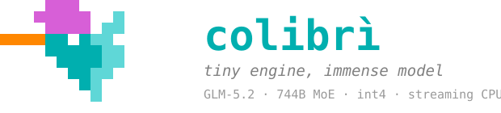

<p align="center">
  
</p>

<p align="center">
  <strong>Aviary</strong> — a self-organizing cluster for running many
  <a href="https://github.com/JustVugg/colibri">Colibri</a> inference engines as one flock
</p>

<p align="center">
  <a href="docs/AVIARY.md"><b>Aviary docs</b></a> ·
  <a href="docs/qwen3_moe.md"><b>Qwen3 test model</b></a> ·
  <a href="aviary-cluster-plan.md"><b>Roadmap</b></a> ·
  <a href="https://github.com/JustVugg/colibri"><b>Colibri (engines)</b></a>
</p>

## What is Aviary?

**Aviary turns N machines into one inference cluster.**

Each machine runs a local [Colibri](https://github.com/JustVugg/colibri) engine — a pure-C,
streaming MoE runtime. Aviary adds the layer above that:

- a **master** that registers nodes, routes requests, and hosts the dashboard
- **agents** that wrap one engine subprocess each and report telemetry
- a **Cluster** UI tab with live node health, load, and per-node expert heatmaps

Point any OpenAI-compatible client (or the built-in web UI) at the master. It forwards
each request to the least-loaded healthy agent. Every agent keeps a full replica of the
model on its own disk/RAM/VRAM (Phase 1). The network is never required for correctness —
a slow or missing node simply stops receiving work.

This repository (`SensAI-PT/aviary-hy3`) is **Aviary**, not upstream Colibri. It ships a
synced Colibri engine base plus the cluster control plane. For engine internals, benchmarks,
and the full model roster, see the [Colibri project](https://github.com/JustVugg/colibri).

## Why "Aviary"?

A **colibrì** (colibri, hummingbird) is tiny, fast, and runs on almost nothing.

An **aviary** is where you keep many of them.

Aviary is the enclosure for a flock of Colibri engines: one bird per node, one roof over
the cluster. The name reflects the goal — not one giant GPU box, but **many modest machines
cooperating** through a shared scheduler while each bird still flies on its own local weights.

## Project goal

Frontier MoE models are too large to treat as a single monolith. Aviary exists to prove
and refine **distributed inference at the cluster layer**:

1. **Phase 1 (now):** full-replica load balancing — register nodes, route chat, stream
   telemetry, survive failures without corrupting output.
2. **Phase 2:** cross-node expert execution — a single forward pass can dispatch expert
   work to peer nodes when placement says it pays.
3. **Phase 3–4:** cluster-wide placement, hot-swap prefetch, Spark-style observability.

The hypothesis is that MoE sparsity plus a smart control plane beats brute-force
single-node residency for teams that already have several boxes with fast local storage.
Aviary is where that hypothesis gets measured on real hardware.

Details: [`aviary-cluster-plan.md`](aviary-cluster-plan.md) · [`docs/AVIARY.md`](docs/AVIARY.md)

## Recommended test model: Qwen3-30B-A3B

For cluster development and proof-scale testing, use **[Qwen3-30B-A3B-Instruct-2507](https://huggingface.co/Qwen/Qwen3-30B-A3B-Instruct-2507)**:

| | |
|---|---|
| Total params | ~30.5B |
| Active per token | ~3.3B |
| Layers / experts | 48L · 128E · top-8 |
| Why here | Large enough to exercise real MoE routing and multi-node replication; small enough to convert, copy to several nodes, and iterate without datacenter-scale storage |

It is the intended **"small yet proof"** model for Aviary: you get authentic sparse-expert
behavior, streaming-from-disk paths, and cluster routing — without Hy3/GLM/Kimi-scale weight
footprints.

```bash
cd c
make qwen3_moe
./coli convert --repo Qwen/Qwen3-30B-A3B-Instruct-2507 --model /path/to/qwen3_i4
```

Full engine and conversion notes: [`docs/qwen3_moe.md`](docs/qwen3_moe.md)

**Local smoke test (no 30B download):**

```bash
cd c
make qwen3_moe
python3 tools/make_qwen3_oracle.py          # tiny random fixture
SNAP=./qwen3_moe_tiny TF=1 ./qwen3_moe 64 16 16   # expect 32/32
```

## Quick start — Aviary cluster

| component | command | default port | role |
|---|---|---|---|
| **master** | `./c/coli master` | HTTP `9000`, control `9002` | Registry, routing, dashboard |
| **agent** | `./c/coli agent --master URL` | HTTP `8001` | One local engine + telemetry |

```bash
git clone https://github.com/SensAI-PT/aviary-hy3.git && cd aviary-hy3/c
./setup.sh

# machine A — master
./coli master --host 0.0.0.0 --port 9000

# machine A — first agent (same model directory on every node)
COLI_MODEL=/path/to/qwen3_i4 ./coli agent --master http://A:9000 --host 0.0.0.0 --port 8001

# machine B — second agent
COLI_MODEL=/path/to/qwen3_i4 ./coli agent --master http://A:9000 --host 0.0.0.0 --port 8001 \
  --advertise-host B
```

Open **http://A:9000**. Chat and the **Cluster** tab go through the master — point the UI at
the master URL, not an individual agent.

Agents heartbeat every 2 s; the master evicts a node after three missed beats and stops
routing to it. Each agent stores a stable node id at `<model_dir>/.aviary_node_id`.

Environment: [`docs/AVIARY.md`](docs/AVIARY.md) · wire format: [`docs/cluster_protocol.md`](docs/cluster_protocol.md)

## Install

```bash
git clone https://github.com/SensAI-PT/aviary-hy3.git && cd aviary-hy3/c
./setup.sh          # builds engines (incl. qwen3_moe), runs tiny self-tests when fixtures exist
./coli info         # sanity check
```

Prebuilt [Colibri release binaries](https://github.com/JustVugg/colibri/releases) do **not**
include `coli master` / `coli agent` — use this repository for the cluster.

Python 3 is required for the launcher and API gateway; inference engines are pure C.

## What Aviary owns vs Colibri

| Layer | Owns | Where |
|---|---|---|
| **Aviary** | Master, agents, registry, cluster protocol, Cluster UI | `c/aviary/`, `coli master`, `coli agent`, `web/src/Cluster.tsx` |
| **Colibri** (synced base) | Per-model C engines, `coli chat`/`serve`, OpenAI HTTP | `c/*.c`, `c/openai_server.py` — see [Colibri](https://github.com/JustVugg/colibri) |

Aviary does not fork engine architectures. When Colibri adds a model family, agents pick it
up automatically once `coli` resolves `config.json`.

## Other supported engines

Any Colibri-supported checkpoint works on agents — the launcher selects the engine from
`config.json`. For day-to-day **Aviary cluster testing**, prefer **Qwen3-30B-A3B** above.

Larger families (Hy3, GLM-5.2, Kimi K3, DeepSeek V4, …) are available via the synced
Colibri base when you need them; see [Colibri's model roster](https://github.com/JustVugg/colibri#other-supported-models)
and per-model docs under `docs/`.

| Family | Active / total | Aviary notes |
|---|---|---|
| **Qwen3 MoE** | 3.3B / 30B | **Recommended for cluster testing** — [`docs/qwen3_moe.md`](docs/qwen3_moe.md) |
| Hy3 | 21B / 295B | [`docs/hy3.md`](docs/hy3.md) |
| DeepSeek V4 Flash | 13B / 284B | [`docs/deepseek-v4.md`](docs/deepseek-v4.md) |
| GLM-5.2, Inkling, Kimi K3, OLMoE | — | Colibri upstream docs |

Same weights on disk on every agent; same `COLI_MODEL` path (or equivalent copy per node).

## Roadmap

| phase | focus | status |
|---|---|---|
| **1** | Node registry, heartbeat, least-loaded routing, Cluster dashboard | ✓ |
| **2** | Cross-node expert RPC, placement scheduler | planned |
| **3** | Request timelines, RPC histograms, replication metrics | planned |
| **4** | Cross-node weight hot-swap prefetch | planned |

Full plan: [`aviary-cluster-plan.md`](aviary-cluster-plan.md)

## Documentation

| topic | doc |
|---|---|
| Aviary overview, env vars, ownership | [docs/AVIARY.md](docs/AVIARY.md) |
| Qwen3 test model (convert, oracle, cluster) | [docs/qwen3_moe.md](docs/qwen3_moe.md) |
| Agent⇄master wire format | [docs/cluster_protocol.md](docs/cluster_protocol.md) |
| Cluster roadmap | [aviary-cluster-plan.md](aviary-cluster-plan.md) |
| OpenAI API, web dashboard | [docs/api.md](docs/api.md) |
| Colibri engines, tuning, benchmarks | [Colibri repository](https://github.com/JustVugg/colibri) |

## Repo layout (Aviary-relevant)

```
c/
├── aviary/               cluster control plane (master, agent, registry, protocol)
├── coli                  CLI: master, agent, chat, serve, …
├── openai_server.py      OpenAI HTTP (used by agents and master proxy)
├── qwen3_moe.c           Qwen3 MoE engine — recommended test target
├── setup.sh              build + tiny self-test
└── tools/
    ├── make_qwen3_oracle.py
    └── convert_qwen3_moe.py
web/                      dashboard — Chat, Brain, Profiling, Cluster tabs
docs/                     Aviary + synced engine docs
aviary-cluster-plan.md    Phase 1–4 plan
```

The Colibri engine tree (`colibri.c`, `hy3.c`, headers, backends, …) lives alongside Aviary
and tracks [upstream Colibri](https://github.com/JustVugg/colibri). Treat it as a dependency,
not as Aviary's product surface.

## Acknowledgements

Aviary builds on [Colibri](https://github.com/JustVugg/colibri) and the Hy3-enabled base
[`ErikTromp/colibri-hy3`](https://github.com/ErikTromp/colibri-hy3). Model weights come from
the open releases behind each engine — including **Alibaba Qwen** for the recommended test
checkpoint.

## License

Apache 2.0. Model weights are subject to each publisher's license.
